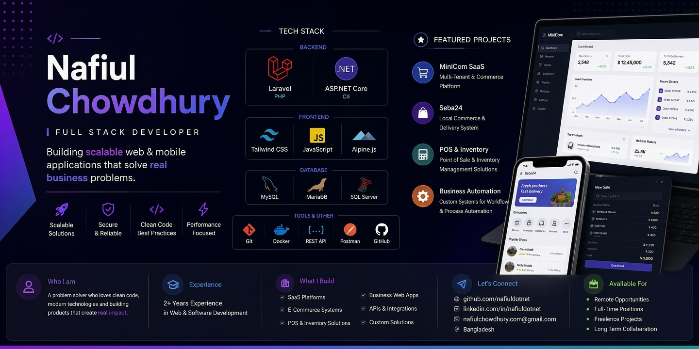

# Nafiul Chowdhury Portfolio Website

## Overview

This repository contains the personal portfolio website for **Nafiul Chowdhury**, a Full Stack Developer based in Dhaka, Bangladesh. The site showcases his skills, experience, top projects, and contact information.

## What’s Included

- **`index.html`** — main portfolio landing page
- **`resume/index.html`** — detailed resume page
- **`assets/css/style.css`** — custom styling for the portfolio
- **`assets/js/script.js`** — portfolio interactions and page behavior
- **`assets/js/jquery.ripples.js`** — ripple effect plugin for backgrounds
- **`assets/img/`** — images used for skills, projects, avatar, and preview
- **`assets/cv.pdf`** — downloadable CV

## Features

- Responsive portfolio layout with a sidebar navigation
- Skills section with both backend and frontend technologies
- Project showcase with live external links
- Contact form and contact details
- Direct resume preview and CV download links

## Live Links

- Portfolio: [https://nafiuldotnet.github.io/](https://nafiuldotnet.github.io/)
- MiniCom Project: [https://minicom.nicsoftit.com/](https://minicom.nicsoftit.com/)
- Seba24BD Project: [https://seba24bd.com/](https://seba24bd.com/)
- Habiganj Pourashava: [https://habiganjpourashava.gov.bd/](https://habiganjpourashava.gov.bd/)

## Local Preview

Open one of the following files in your browser:

- `index.html`
- `resume/index.html`

## Useful Links

- Download CV: [`assets/cv.pdf`](assets/cv.pdf)
- View resume: [`resume/index.html`](resume/index.html)
- GitHub: [https://github.com/nafiuldotnet](https://github.com/nafiuldotnet)
- LinkedIn: [https://linkedin.com/in/nafiuldotnet/](https://linkedin.com/in/nafiuldotnet/)
- Facebook: [https://fb.me/nafiuldotnet/](https://fb.me/nafiuldotnet/)

## Technologies Used

- HTML5
- CSS3
- JavaScript
- Tailwind CSS
- W3.CSS
- Font Awesome
- jQuery
- CKEditor

## Contact

- Email: `nafiulchowdhury.com@gmail.com`
- Phone: `+8801756702946`
- Location: North Kazipara, Mirpur, Dhaka, Bangladesh
